Jarvis is a desktop app for CS1101S Teaching Assistants (Avengers), optimized for use via a Command Line Interface (CLI) while still having the benefits of a Graphical User Interface (GUI). If you can type fast, Jarvis can get your TA administrative tasks done faster than traditional GUI apps.

## Table of Contents

1. [Overview](#1-overview)
    - [1.1 Introduction](#11-introduction)
    - [1.2 Purpose](#12-purpose)
    - [1.3 Design Considerations](#13-design-considerations)
2. [About the User Guide](#2-about-the-user-guide)
    - [2.1 Symbols](#21-symbols)
3. [Quick start](#3-quick-start)
4. [Navigating Jarvis](#4-navigating-jarvis)
    - [4.1 UI Layout](#41-ui-layout)
        * [4.1.1 Top Bar](#411-top-bar)
        * [4.1.2 Command Box](#412-command-box)
        * [4.1.3 Feedback Box](#413-feedback-box)
        * [4.1.4 Information Panel](#414-information-panel)
        * [4.1.5 Tab Switcher](#415-tab-switcher)
5. [Logging into Jarvis](#5-logging-into-jarvis)
    - [5.1 Prompt](#51-prompt)
    - [5.2 Updated Details Summary](#52-updated-details-summary)
    - [5.3 Updated Student Information](#53-updated-student-information)
6. [Features](#6-features)
    - [6.1 General Notes](#61-general-notes)
        * [6.1.1 Notes about Command Format](#611-notes-about-command-format)
        * [6.1.2 Notes about Jarvis' relationship with Source Academy](#612-notes-about-jarvis-relationship-with-source-academy)
        * [6.1.3 Notes about Tasks](#613-notes-about-tasks)
        * [6.1.4 Notes about truncation](#614-notes-about-truncation)
        * [6.1.5 Notes about Summary feature](#615-notes-about-summary-feature)
    - [6.2 Viewing help : `help`](#62-viewing-help--help)
    
    

    
    - [6.3 Adding Information : `add`](#63-adding-information--add)
        * [6.3.1 Adding Consultations : `add -c`](#631-adding-consultations---c)
        * [6.3.2 Adding Mastery Checks : `add -mc`](#632-adding-mastery-checks---mc)
        * [6.3.3 Adding Todos : `add -t`](#633-adding-todos--t)
        * [6.3.4 Adding Events : `add -e`](#634-adding-events---e)
        * [6.3.5 Adding Deadlines : `add -d`](#635-adding-deadlines---d)
    - [6.4 Editing Information : `edit`](#64-editing-information--edit)
        * [6.4.1 Editing Login information : `edit -l`](#641-editing-login-information---l)
        * [6.4.2 Editing Student information : `edit -s`](#642-editing-student-information---s)
        * [6.4.3 Editing Mastery Checks : `edit -mc`](#643-editing-mastery-checks---mc)
    - [6.5 Deleting Information : `delete`](#65-deleting-information--delete)
        * [6.5.1 Deleting Consultations : `delete -c`](#651-deleting-consultations---c)
        * [6.5.2 Deleting Mastery Checks : `delete -mc`](#652-deleting-mastery-checks---mc)
        * [6.5.3 Deleting Tasks : `delete -t`](#653-deleting-tasks---t)
    - [6.6 Viewing Information : `view`](#66-viewing-information--view)
        * [6.6.1 Viewing a list of all Students : `view -s`](#661-viewing-a-list-of-all-students---s)
        * [6.6.2 Viewing Student with keyword : `view -s NAME`](#662-viewing-student-with-keyword---s-name)
        * [6.6.3 Viewing deadline for Missions: `view -m`](#663-viewing-deadline-for-missions---m)
        * [6.6.4 Viewing ungraded Missions: `view -um`](#664-viewing-ungraded-missions---um)
        * [6.6.5 Viewing deadline for Quests: `view -q`](#665-viewing-deadline-for-quests---q)
        * [6.6.6 Viewing ungraded Quests: `view -uq`](#666-viewing-ungraded-quests---uq)
        * [6.6.7 Viewing all Consultations: `view -c`](#667-viewing-all-consultations---c)
        * [6.6.8 Viewing past Consultations: `view -cp`](#668-viewing-past-consultations---cp)
        * [6.6.9 Viewing upcoming Consultations: `view -cu`](#669-viewing-upcoming-consultations--cu)
        * [6.6.10 Viewing all Mastery Checks: `view -mc`](#6610-viewing-all-mastery-checks---mc)
        * [6.6.11 Viewing past Mastery Checks: `view -mcp`](#6611-viewing-past-mastery-checks---mcp)
        * [6.6.12 Viewing upcoming Mastery Checks: `view -mcu`](#6612-viewing-upcoming-mastery-checks--mcu)
        * [6.6.13 Viewing all Tasks: `view -t`](#6613-viewing-all-tasks---t)
        * [6.6.14 Viewing all Todos: `view -tt`](#6614-viewing-all-todos---tt)
        * [6.6.15 Viewing all Events: `view -te`](#6615-viewing-all-events---te)
        * [6.6.16 Viewing all Deadlines: `view -td`](#6616-viewing-all-deadlines---td)
    - [6.7 Exiting the program: `exit`](#67-exiting-the-program--exit)
    - [6.8 Saving the data](#68-saving-the-data)
7. [Command Summary](#7-command-summary)
    - [7.1 Add Command Summary](#71-add-command-summary)
    - [7.2 Edit Command Summary](#72-edit-command-summary)
    - [7.3 Delete Command Summary](#73-delete-command-summary)
    - [7.4 View Command Summary](#74-view-command-summary)
    - [7.5 Exit Command Summary](#75-exit-command-summary)
    - [7.6 Help Command Summary](#76-help-command-summary)
    
    

8. [Glossary](#8-glossary)
    - [8.1 Difference Between Consultations and Mastery Checks](#81-difference-between-consultations-and-mastery-checks)
9. [FAQ](#9-faq)

## 1. Overview

### 1.1 Introduction
Jarvis is a desktop app for CS1101S Teaching Assistants (Avengers), optimized for use via a Command Line Interface (CLI)
while still having the benefits of a Graphical User Interface (GUI). Jarvis in general helps to organise and simplify
CS1101S tutors' administrative tasks.

### 1.2 Purpose
As an Avenger, not only do you have immense power but you are also burdened with inevitable great responsibility.
Not to worry, Jarvis is here to empower you to manage your personal tasks while teaching others efficiently and
effectively.

### 1.3 Design Considerations
Our design philosophy that has guided us through the development of Jarvis is to place the user experience at the core of all considerations.
As such, you will find throughout the User Guide small features and language that we have deliberately chosen to enhance usability and improve the user-centered experience of our product.
We have highlighted several features below that we feel are reflective of our design philosophy.

1. You can toggle between your past and future commands entered by using the up and down arrows respectively.

1. Everytime a command has been entered, Jarvis will switch to the relevant tab automatically.

1. Important information such as `Student`, `Mission`, `Quest`, etc will not be deleted when the user keys in the wrong login information. We wish to give users the benefit of doubt and not delete their information as we do believe accidents can happen.

## 2. About the User Guide
This section aims to remind you of the important parts to take note of while reading the user guide.

### 2.1 Symbols
When reading this user guide, various symbols may appear occasionally to draw your attention to important information.
The meaning for each symbol is as follows:

Symbol | Meaning
-------| ------------
 ⚠️   | This symbol indicates that there is something important for you to take note of.
 ✏️   | This symbol indicates that an example is provided.

## 3. Quick start

1. Ensure you have Java 11 or above installed in your Computer.

1. Download the latest _`jarvis.jar`_ and the `chrome_driver.zip` from [here](https://github.com/AY2021S1-CS2103T-W11-2/tp/releases/tag/v1.4).
Unzip the zip file.
It is crucial to have the Chrome Driver in order for Jarvis to start up. If the GUI does not launch,
please check that you have installed the correct driver in the unzipped folder:
    1. Windows: chromedriver.exe
    1. MacOS: chromedriver_mac
    1. Linux: chromedriver_linux

1. Copy both file and folder to the directory you want to use as the _home directory_ for your Jarvis.

1. There are two options for launching Jarvis.
    1. Double-click the `jarvis.jar` file to start the app.
    1. Launch Jarvis from the Windows Command Prompt or MacOS command line by navigating to the directory containing `jarvis.jar`,
    then typing the command `java -jar jarvis.jar`

    A GUI similar to the screenshot below should appear in a few seconds.
    
    

   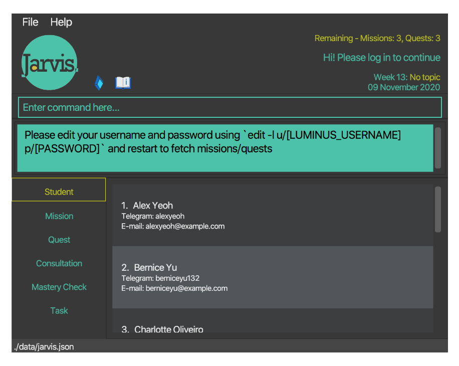

1. Upon start up, you will be prompted to log in to unlock Jarvis's
 full set of features.
 Please refer to the logging in segment below to complete your login.
 Do note that after editing your login details, exiting and relaunching the Jarvis User interface will take some time
 as Jarvis is attempting to log you into Source Academy.

1. Type the command in the command box and press Enter to execute it. E.g. typing help and pressing Enter will open the help window.
   Some example commands you can try:
   * `view -s:  Lists all Students.`
   * `view -s NAME: Lists information about a Student named John Doe.`
   * `add -t DESCRIPTION: Adds a Todo task with specified description.`
   * `edit -s STUDENT_ID: Edits Student's Name, Email, Telegram.`
   * `exit: Exits the app.`
 
1. Refer to the [Features](#6-features) below for details of each command.

1. Do note that the sample data displayed on initial startup of Jarvis will not be saved. This means that subsequent launches of Jarvis will only contain user-inputted data.

## 4. Navigating Jarvis

Jarvis has a Graphical User Interface centered around a command input box on the top, surrounded by a light green
line. The green box below the command input box is the user feedback box. Jarvis provides feedback to the user through
this box.

### 4.1 UI Layout

   

   * The user interface is split into five separate segments.
        1. Top bar - Passive information, such as a summary for the user, greeting message, week number, topic for
         the week and today's date is presented to the user. An explanation on each information can be found below.
        1. Command Box - An input box for user's commands to be keyed in.
        1. Feedback Box - The feedback shown to the user for a given inputted command.
        1. Information Panel - A detailed list on the information stored within Jarvis.
        1. Tab Switcher - A tab switcher for browsing through the different types of information stored in Jarvis.

#### 4.1.1 Top Bar
    
   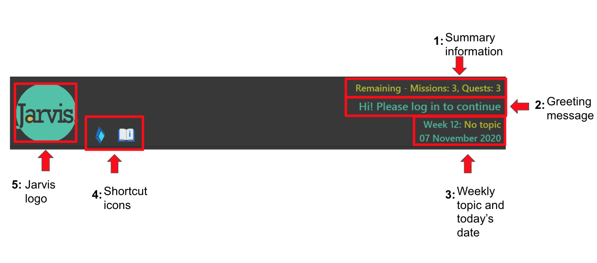

   * The top bar includes the following components.
        1. Summary information - A quick summary indicating the number of ungraded `Missions` and `Quests`, upcoming
           `Consultations` and `Mastery Checks` as well as all `Tasks` in Jarvis. Do note that graded `Missions` and
           `Quests`, as well as past `Consultations` and `Mastery Checks`, will not be indicated.
           
           We refer to this summary as the `Summary` feature. The summary is presented as a sentence containing the
           count of the fields stated in the previous paragraph, in the image above, it is the sentence "Remaining - Nothing!". The values are updated when Jarvis starts up and after a user command is entered.
             
        1. Greeting message - A welcome message for you. If you are not logged in, this message will prompt you to do
         so.
        1. Weekly topic and today's date - The week count for the semester, together with the topic for the week and
         today's date.
        1. Shortcut icons - These icons are positioned here for your convenience to quickly navigate to Source Academy
         with the blue diamond on the left, and Jarvis' user guide with the white book icon on the right.
        1. Jarvis logo.

#### 4.1.2 Command Box

   * A text input box for all user commands to be keyed in. You may refer to a detailed guide on the various commands
    available in Jarvis. Hit the enter key to execute the inputted command.

#### 4.1.3 Feedback Box

   * A box that shows the corresponding feedback to the user according to the commands keyed in. If the command is
   successful, a success message will be shown. Otherwise, error messages guiding the user will be displayed.

#### 4.1.4 Information Panel
   * A detailed list of information that corresponds to the tab selected in the Tab Switcher on the left of the
    Graphical User Interface (GUI).

#### 4.1.5 Tab Switcher

   * The tab switcher contains clearly marked tabs: `Student`, `Mission`, `Quest`, `Consultation`, `Mastery Check`, `Task`.
   * `Todo`, `Event` and `Deadline` are all variants of `Task`.
   * Clicking on each tab will give you the information you require for that field.  

 
 > ⚠️ The core features of Jarvis are based on `Students`, `Missions`, `Quests`, `Consultations`, `Mastery Checks` and
 > `Tasks`.
 >
 > ⚠️ Each core feature has a tab for the organisation of its information.

To navigate the features, there are 2 methods which could be used individually, or mixed. We have designed
this flexibility with you, the user in mind.
 1. Only inputting commands into the box annotated "Enter command here...". Upon the successful execution of a
  command, the tab is automatically switched to the corresponding tab for your convenience.
 1. Clicking on the tabs.

## 5. Logging into Jarvis

The following is the prompt upon first login, you are prompted to key in your Source Academy username and password:

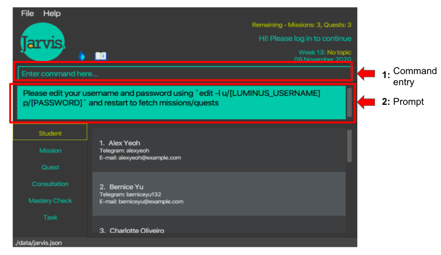

### 5.1 Prompt
The prompt contains the format of the edit command to be keyed in. The format is reinstated below for clarity.

To log in, simply edit your login details with the following command:

 **Format: `edit -l u/LUMINUS_USERNAME p/LUMINUS_PASSWORD`**

 ✏️ Examples:
* `edit -l u/nusstu\e1234567 p/testpassword`

An example of the command being inputted:

### 5.2 Updated Details Summary
Within the red rectangle box, Jarvis will notify you if the login was successful and the login information entered.
The username, password and student names are covered with a red rectangle for this diagram only to protect the Avenger's account security.
You will be able to see the login details you entered.

### 5.3 Updated Student Information
Upon success, all information from Source Academy will be visible to you. The student information tab will display you student information.
The `Telegram` and `E-mail` fields are test values as these information are not available on Source Academy.
You will have to edit them using the [Editing Student Information](#642-editing-student-information---s) command below.

## 6. Features

### 6.1 General Notes
This section includes some general notes on Jarvis.

#### 6.1.1 Notes about Command Format

   * Words in UPPER_CASE are the parameters to be supplied by you.
     e.g. in `add -t DESCRIPTION`, `DESCRIPTION` is a parameter which can be used as `add -t Mark Missions`.

   * Items in square brackets are optional.
     e.g `view -s [NAME]`, `NAME` is an optional parameter. It can be used as `view -s` or as `view -s [John]`.

   * Parameters can be in any order, unless specified otherwise.
     e.g. if the command specifies `t/TELEGRAM e/EMAIL`, `e/EMAIL t/TELEGRAM` is also acceptable.

   * When there are repeated parameters, Jarvis only recognizes the data given by the last repeated parameter.
     e.g. if the command specifies `t/TELEGRAM e/EMAIL` and the user enters `t/TELEGRAM t/TELEGRAM2 e/EMAIL e/EMAIL2 e/EMAIL3`, Jarvis recognizes the input as `t/TELEGRAM2 e/EMAIL3`.

#### 6.1.2 Notes about Jarvis' relationship with Source Academy
   * Students’ names that are under the Avenger will be fetched automatically from [https://sourceacademy.nus.edu.sg](https://sourceacademy.nus.edu.sg) upon startup.
   * LumiNUS username and passwords will be stored in plaintext.

#### 6.1.3 Notes about Tasks
   * Each `Task` you create, be it `Todo`, `Event` or `Deadline`, there will be an unique Task ID assigned to each of them, so
   that there will be no 2 of the same ID in your Task List at any point of time. The Task ID is reflected as
    eg. D1, E5, T21
   * The first alphabet "T", "E" and "D" refers to `Todo`, `Event`, and `Deadline` respectively, and the number followed
   after the alphabet is the index of the `Task` you created with respect to all the `Tasks` you ever created.

#### 6.1.4 Notes about truncation
   * If the user input is too long, it is automatically truncated when displayed.
     e.g. if the user enters a `NAME` parameter that is 150 characters long, Jarvis will automatically truncate it to fit the given screen size.
   
#### 6.1.5 Notes about Summary feature
   * As mentioned above under the section explaining the top bar, the `Summary` feature is updated when Jarvis is
   launched and after a user command is successfully executed. As such, the values in the `Summary` will remain the same, even if
   the current time has passed the date and time of a `Consultation` or `Mastery Check`. Also, if a `Mission` or
   `Quest` is graded while Jarvis is open, the number of ungraded `Mission` and `Quests` will remain the same.
   * To get the updated values, simply re-start Jarvis or type in a command and hit the enter key on your keyboard.
   * The `Summary` feature will display all `Tasks` stored in Jarvis, regardless of a `Deadline` or `Event`'s date and
    time. This is in contrast to `Consultations` and `Mastery Checks` where only the upcoming ones are included in
    the count.

### 6.2 Viewing help : `help`

Shows a message explaining how to access the help page.

 **Format: `help`**

### 6.3 Adding Information : `add`

#### 6.3.1 Adding `Consultations` : `-c`

Adds a `Consultation` session with a `Student` at a specific date and time.

 **Format: `add -c NAME d/YYYY-MM-DD t/HH:MM`**

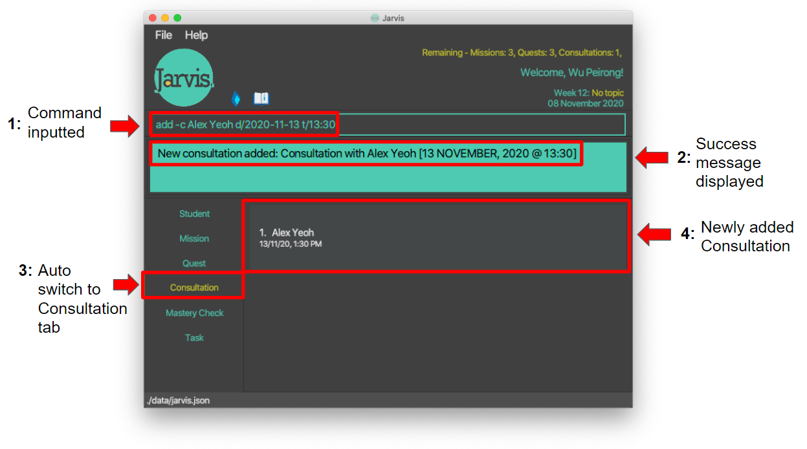

 ✏️ Examples:
* `add -c John Doe d/2020-09-20 t/13:30`
* `add -c Mary Jane d/2021-01-02 t/09:15`

 ⚠️ Notes:
* When you add a `Consultation` for a future date while displaying only past `Consultations`, make sure to enter `view -c` to view the complete list to check if the `Consultation` has been added correctly.
* Similarly, when you add a `Consultation` for a past date while displaying only future `Consultations`, make sure to enter `view -c`.
* `NAME` does not have to correspond to an existing student; this is so that the tutor may freely use any nicknames or other identifiers as they see fit. However, it may not be left empty.
* Because date and time is considered in order, the d/ prefix must come earlier than t/.

#### 6.3.2 Adding `Mastery Checks` : `-mc`

Adds a `Mastery Check` session with a `Student` at a specific `date` and `time`.

 **Format: `add -mc NAME d/YYYY-MM-DD t/HH:MM`**

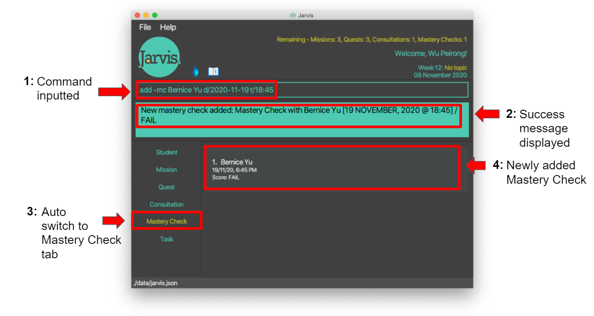

 ✏️ Examples:
* `add -mc John Doe d/2020-09-20 t/13:30`
* `add -mc Mary Jane d/2021-01-02 t/09:15`

* When you add a `Mastery Check` for a future date while displaying only past `Mastery Checks`, make sure to enter `view -mc` to view the complete list to check if the `Mastery Check` has been added correctly.
* Similarly, when you add a `Mastery Check` for a past date while displaying only future `Mastery Check`, make sure to enter `view -mc`.
* `NAME` does not have to correspond to an existing student; this is so that the tutor may freely use any nicknames or other identifiers as they see fit. However, it may not be left empty.
* Because date and time is considered in order, the d/ prefix must come earlier than t/.
* When a `Mastery Check` is first added, a `FAIL` default value will be assigned.

#### 6.3.3 Adding `Todos` : `-t`

Adds your personal `Todo` with a `description`.

 **Format: `add -t DESCRIPTION`**

 ✏️ Examples:
* `add -t Clear the bin`
* `add -t Return calculator to Mary`

* The way to input is similar to the screenshot of adding `Mastery Check` above, only without the date and time.

#### 6.3.4 Adding `Events` : `-e`

Adds your personal `Event` with a `description`, to attend at a specific date and time.

 **Format: `add -e DESCRIPTION d/YYYY-MM-DD t/HH:MM`**

 ✏️ Examples:
* `add -e John’s birthday party d/2020-09-21 t/20:00`
* `add -e CS2103T team meeting d/2020-09-27 t/10:30`

* An `Event` requires extra date and time specifications in order to create. The way to input is similar to the screenshot of adding `Mastery Check` above.

#### 6.3.5 Adding `Deadlines` : `-d`

Adds your personal `Deadline` with a `description`, to complete by a specific date and time.

 **Format: `add -d DESCRIPTION d/YYYY-MM-DD t/HH:MM`**

 ✏️ Examples:
* `add -d CS2103T Week 5 ip tasks d/2020-09-08 t/23:59`
* `add -d Research project report d/2020-10-05 t/10:30`

* Similar to `Event`, a `Deadline` requires extra date and time specifications in order to create. You can refer to the screenshot of adding `Mastery Check` above for a real-life example of how the command would look like.

### 6.4 Editing Information : `edit`

#### 6.4.1 Editing Login Information : `-l`

You can use tags to specify the field to be edited.

 **Format: `edit -l [u/LUMINUS_USERNAME] [p/LUMINUS_PASSWORD]`**

 ✏️ Examples:
* `edit -l u/nusstu\e1234567 p/testpassword`
* `edit -l p/testpassword`

At least one of the optional parameters must be provided.

* Do note that it takes a load time of around ~5 seconds after entering this command for the changes from Source Academy to be reflected in the GUI.
* After the `Students`, `Missions` and `Quests` have loaded, take note that the `Telegram` and `Email` fields of the `Student` are placeholder values.
* This is because Source Academy does not contain these 2 fields of any `Student`. Editing the `Student` details will save the updated values.
* After a TA account has been used to log in and fetch the information, logging in with a non-TA account will not change the information displayed
as we choose to give you the benefit of doubt of keying in the wrong login details.
* Whenever a TA account is used to log in, the information will always be updated to reflect the logged in TA's `Student`,
`Mission` and `Quest` information.

#### 6.4.2 Editing `Student` Information : `-s`

Edits the fields of a `Student`.

 **Format: `edit -s INDEX [n/NAME] [t/TELEGRAM] [e/EMAIL]`**

 ✏️ Examples:
* `edit -s 1 e/koolguy@gmail.com t/handsome`
* `edit -s 3 n/Timots`

You can refer to the screenshot below for how the input will look like.

#### 6.4.3 Editing `Mastery Checks` : `-mc`

At least one of the optional parameters must be provided.
Edits the score of a `Mastery Check` session with a `Student`.

 **Format: `edit -mc INDEX s/SCORE`**

 ✏️ Examples:
* `edit -mc 1 s/0`
* `edit -mc 3 s/1`

* Do note that the `SCORE` parameter can only be 0 or 1, according to the actual restrictions of `Mastery Check` pass/fail in CS1101S.
* The `INDEX` parameter should be a non-zero unsigned integer that is a valid index currently displayed along with the target `Mastery Check`.
* Jarvis allows editing to the same value; even if no values are actually updated by the command, it will display a success message.

### 6.5 Deleting Information : `delete`

#### 6.5.1 Deleting `Consultations` : `-c`

Deletes a `Task` based on the `INDEX` you specify.

 **Format: `delete -c INDEX`**

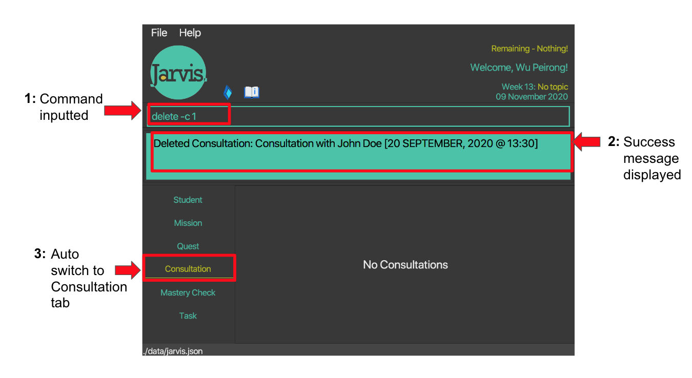

 ✏️ Examples:
* `delete -c 3`

* The `INDEX` parameter should be a non-zero unsigned integer that is a valid index currently displayed along with the target `Consultation`.

#### 6.5.2 Deleting `Mastery Checks` : `-mc`

Deletes a `Mastery Check` based on the `INDEX` you specify.

 **Format: `delete -mc INDEX`**

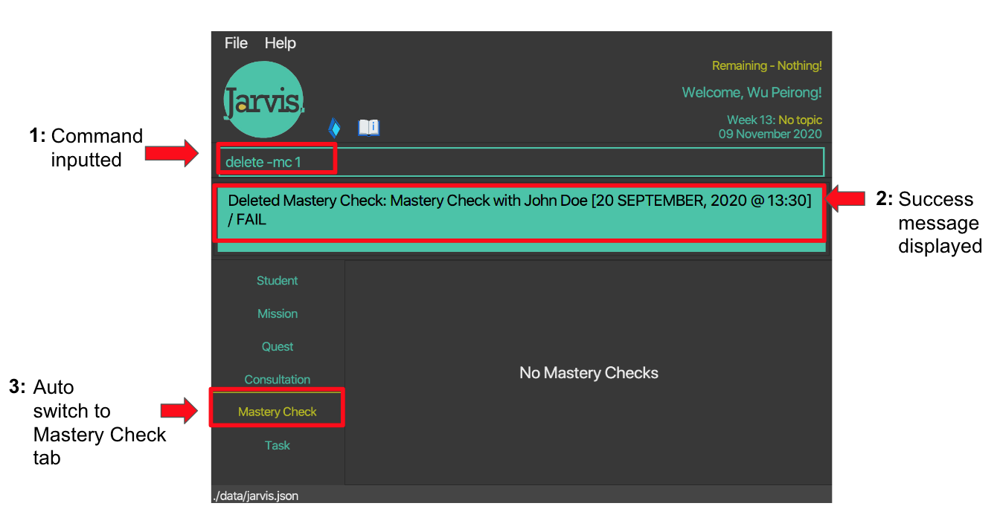

 ✏️ Examples:
* `delete -mc 3`

* The `INDEX` parameter should be a non-zero unsigned integer that is a valid index currently displayed along with the target `Mastery Check`.

#### 6.5.3 Deleting `Tasks` : `-t`

Deletes a `Task` based on the `TASK_ID` you specify.

 **Format: `delete -t TASK_ID`**

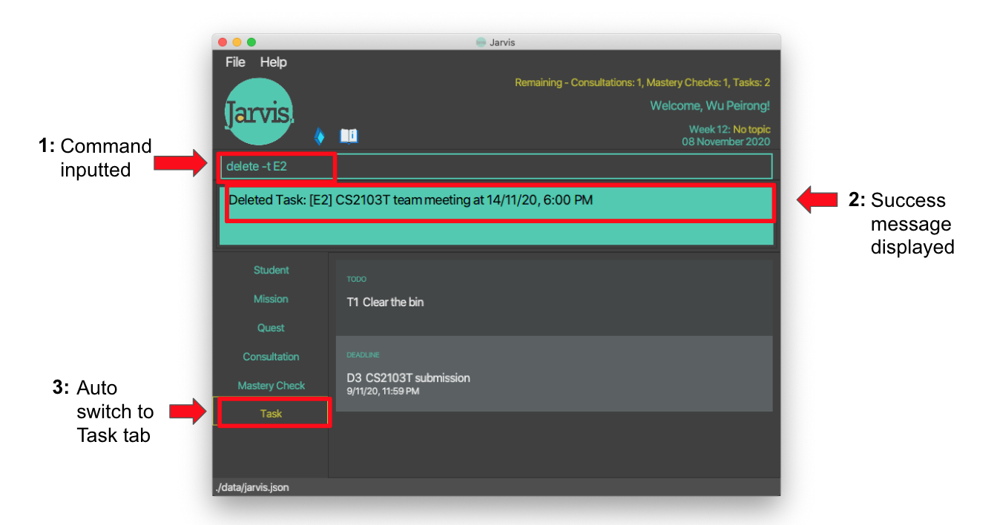

 ✏️ Examples:
* `delete -t T3`
* `delete -t D2`

* Note that TASK_ID, once given, is permanent and no other Tasks can receive that TASK_ID even after the deletion of the original one. 
* The Index for Consultation and MasteryCheck is not unique and they will change according to the GUI's displayed list, which is unlike the TASK_ID for `Task`s.

### 6.6 Viewing Information : `view`

#### 6.6.1 Viewing a list of all `Students` : `-s`

Shows a list of all `Students` under the tutor in Jarvis.
Please take note of the command inputted into the command box to understand how the respective commands are inputted.

 **Format: `view -s`**

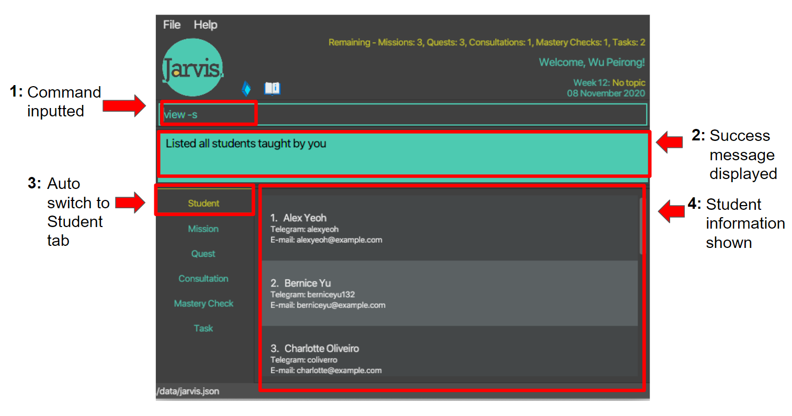

#### 6.6.2 Viewing `Student` with keyword : `-s NAME`

Shows all `Students` that match (partial and full) the name entered after the command. The following is an example where the name is case-sensitive
and partial name matches will work. If you would like to look for your student Tommy Hilfiger, you can simply type in `view -s Tom` 
and the student will be displayed. A full match on the other hand would be as such: key in the command `view -s John Doe` and John
Doe will be displayed.

 **Format: `view -s NAME`**

 ✏️ Examples:
* `view -s John Doe`

#### 6.6.3 Viewing deadline for `Missions` : `-m`

Shows the deadline for the current `Missions`.

 **Format: `view -m`**

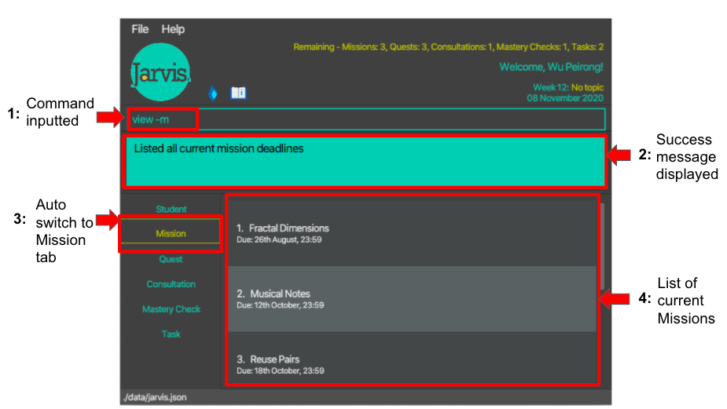

#### 6.6.4 Viewing ungraded `Missions` : `-um`

Shows the `Missions` that you have not yet graded.

 **Format: `view -um`**

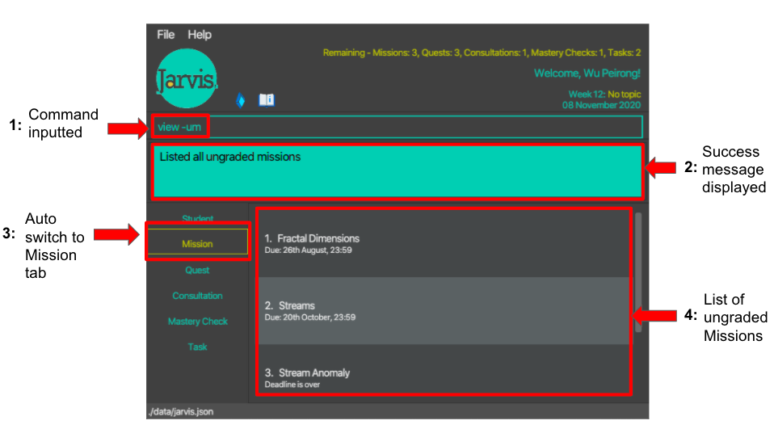

#### 6.6.5 Viewing deadline for `Quests` : `-q`

Shows the deadline for the current `Quests`.

 **Format: `view -q`**

#### 6.6.6 Viewing ungraded `Quests` : `-uq`

Shows the `Quests` that you have not yet graded.

 **Format: `view -uq`**

#### 6.6.7 Viewing all `Consultations` : `-c`

Shows all confirmed `Consultation` sessions, both past and upcoming.
 **Format: `view -c`**

 ✏️ Examples:
* `view -c`

#### 6.6.8 Viewing past `Consultations` : `-cp`

Shows all past `Consultation` sessions.

 **Format: `view -cp`**

 ✏️ Examples:
* `view -cp`

* When the `Consultation` time is the same as the local time (year, month, date, hour, and minute all equal), it is considered to have occurred in the past.

#### 6.6.9 Viewing upcoming `Consultations`: `-cu`

Shows all upcoming `Consultation` sessions.

 **Format: `view -cu`**

 ✏️ Examples:
* `view -cu`

* When the time of the `Consultation` displayed by `view -cu` is earlier than the local time (to year, month, date, hour, and minute) and then caught up eventually, it is still considered as an upcoming `Consultation` when you enter `view -cu`. This is to encourage the tutors to have this screen open while holding the `Consultation` session. When you switch to another command, such as `view -c` or `view -cp`, and then come back, you may see the updated filtered `Consultation` list with the current local time as the standard.

#### 6.6.10 Viewing all `Mastery Checks` : `-mc`

Shows all confirmed `Mastery Check` sessions, both past and upcoming.

 **Format: `view -mc`**

 ✏️ Examples:
* `view -mc`

#### 6.6.11 Viewing past `Mastery Checks` : `-mcp`

Shows all past `Mastery Check` sessions.

 **Format: `view -mcp`**

 ✏️ Examples:
* `view -mcp`

* When the `Mastery Check` time is the same as the local time (year, month, date, hour, and minute all equal), it is considered to have occurred in the past.

#### 6.6.12 Viewing upcoming `Mastery Checks` : `-mcu`

Shows all upcoming `Mastery Check` sessions.

 **Format: `view -mcu`**

 ✏️ Examples:
* `view -mcu`

* When the time of the `Mastery Check` displayed by `view -mcu` is earlier than the local time (to year, month, date, hour, and minute) and then caught up eventually, it is still considered as an upcoming `Mastery Check` when you enter `view -mcu`. This is to encourage the tutors to have this screen open while holding the `Mastery Check` session. When you switch to another command, such as `view -mc` or `view -mcp`, and then come back, you may see the updated filtered `Mastery Check` list with the current local time as the standard.

#### 6.6.13 Viewing all `Tasks` : `-t`

Shows the list of all your current `Tasks`.
This includes `Todo`, `Event` and `Deadline`, which are all considered `Tasks`.

 **Format: `view -t`**

#### 6.6.14 Viewing all `Todos` : `-tt`

Shows the list of all your current `Todos`.

 **Format: `view -tt`**

#### 6.6.15 Viewing all `Events` : `-te`

Shows the list of all your current `Events`.

 **Format: `view -te`**

#### 6.6.16 Viewing all `Deadlines` : `-td`

Shows the list of all your current `Deadlines`.

 **Format: `view -td`**

### 6.7 Exiting the program : `exit`

Exits the program.

 **Format: `exit`**

### 6.8 Saving the data

Jarvis data are saved in the file `jarvis.json` automatically after any command that changes the data. There is no need to save manually.

Note that only `Student`, `Consultation`, `Mastery Check` and `Task` data are saved to the hard drive since `Mission` and `Quest` data
are likely to change frequently and hence, will not need to be persisted.

## 7. Command Summary

### 7.1 Add Command Summary

| Function | Tag | Format, Examples |
| -------- | --- | ---------------- |
| Add `Consultation` | -c | add -c NAME d/YYYY-MM-DD t/HH:MM |
| Add `Mastery Check` | -mc | add -mc NAME d/YYYY-MM-DD t/HH:MM |
| Add `Todo` | -t | add -t DESCRIPTION |
| Add `Event` | -e | add -e DESCRIPTION d/YYYY-MM-DD t/HH:MM |
| Add `Deadline` | -d | add -d DESCRIPTION d/YYYY-MM-DD t/HH:MM |

### 7.2 Edit Command Summary

| Function | Tag | Format, Examples |
| -------- | --- | ---------------- |
| Edit Login information | -l | edit -l [u/LUMINUS_USERNAME] [p/LUMINUS_PASSWORD] |
| Edit `Student` information | -s | edit -s INDEX [n/NAME] [t/TELEGRAM] [e/EMAIL] |
| Edit `Mastery Check` | -mc | edit -mc INDEX s/SCORE |

### 7.3 Delete Command Summary

| Function | Tag | Format, Examples |
| -------- | --- | ---------------- |
| Delete `Consultation` | -c | delete -c INDEX  E.g. delete -c 2 |
| Delete `Mastery Check` | -mc | delete -mc INDEX  E.g. delete -mc 2 |
| Delete `Task` | -t | delete -t TASK_ID |

### 7.4 View Command Summary

| Function | Tag | Format, Examples |
| -------- | --- | ---------------- |
| View all `Students` | -s | view -s |
| View `Student` with keyword | -s | view -s NAME |
| View deadlines for `Missions` | -m | view -m |
| View ungraded `Missions` | -um | view -um |
| View deadlines for `Quests` | -q | view -q |
| View ungraded `Quests` | -uq | view -uq |
| View all `Consultations` | -c | view -c |
| View past `Consultations` | -cp | view -cp |
| View upcoming `Consultations` | -cu | view -cu |
| View all `Mastery Checks` | -mc | view -mc |
| View past `Mastery Checks` | -mcp | view -mcp |
| View all upcoming `Mastery Checks` | -mcu | view -mcu  |
| View all `Tasks` | -t | view -t |
| View all `Todos` | -tt | view -tt |
| View all `Events` | -te | view -te |
| View all `Deadlines` | -td | view -td |

### 7.5 Exit Command Summary

| Function | Format, Examples |
| -------- | ---------------- |
| Exits program | `exit` |

### 7.6 Help Command Summary

| Function | Format, Examples |
| -------- | ---------------- |
| Provide help with program commands | `help` |

## 8. Glossary
### 8.1 Difference Between `Consultations` and `Mastery Checks`
`Mastery Checks` are a specific type of `Consultations` that is mandatory and graded in CS1101S, unlike normal `Consultations`, and thus are displayed in separate tabs in Jarvis.

## 9. FAQ

`Q: How do I transfer my data to another Computer?`
 `A: Install the app in the other computer and overwrite the empty data file (jarvis.json file) it creates with the file (jarvis.json file) that contains the data of your previous Jarvis home folder.`
